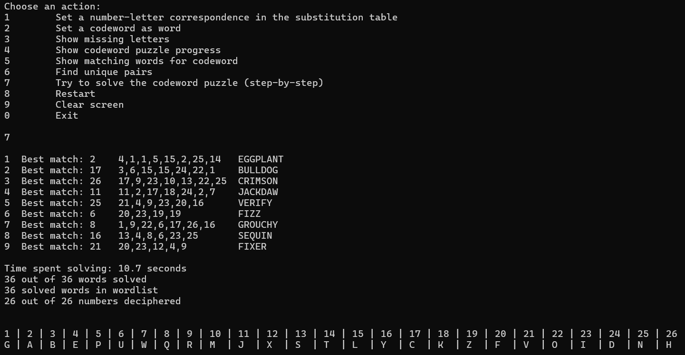
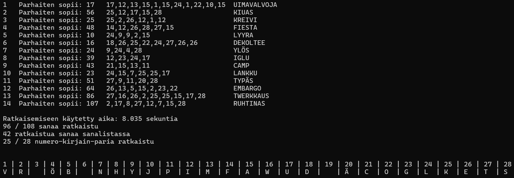

# Codeword puzzle / krypto helper

This CLI app tries to help solve a codeword puzzle by matching codewords to a wordlist.



The app requires a file with a list of words. To take advantage of such a file the app checks the file `krypto.conf`: each language has a section in this file containing the name and the "alphabet" of the language (to filter out words with characters not in the "alphabet"), and more importantly the path to the wordlist to use for this language. Make sure that the path to the wordlist file is correct in `krypto.conf`. This configuration file also has an option to set a "codeword_folder_path", that is, a path to the folder where the app searches for csv files containing codewords.

Currently, the default `krypto.conf` has entries for Finnish and English languages, and points to wordlist filepaths `wordlist_fi.txt` and `wordlist_en.txt`, respectively. The actual wordlist files are not part of this repository. Personally, I have used modified versions (thus the renaming of files) of wordlists [nykysuomensanalista2024](https://kotus.fi/sanakirjat/kielitoimiston-sanakirja/nykysuomen-sana-aineistot/nykysuomen-sanalista/) and `words_alpha.txt` from [List of English words](https://github.com/dwyl/english-words).

<!-- At the moment this script looks for the wordlist in the file named `nykysuomensanalista2024.txt` (in the same directory), and this file is expected to be similar to [nykysuomensanalista2024.txt](https://kaino.kotus.fi/lataa/nykysuomensanalista2024.txt), that is, this file can be handled like a tab-separated csv-file.

As for English words, this has been tested by using the file `words_alpha.txt` from [List of English words](https://github.com/dwyl/english-words). -->

To use this app, just write codewords to a (actually comma-separated) csv file and run
```
python krypto.py
```
This prompts you to select language and type the path to the file with the codewords in it. If you want to bypass these selections, you can add the language tag and filepath as extra arguments, i.e. run command of form
```
python krypto.py en file_with_codewords.csv
```


